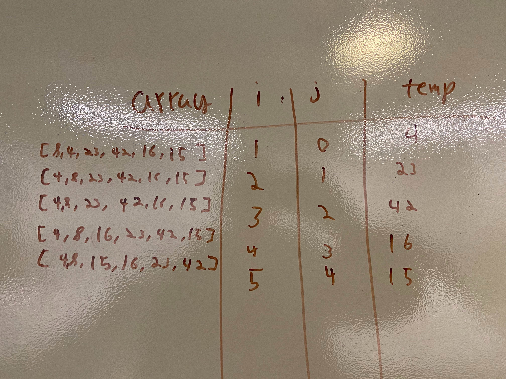
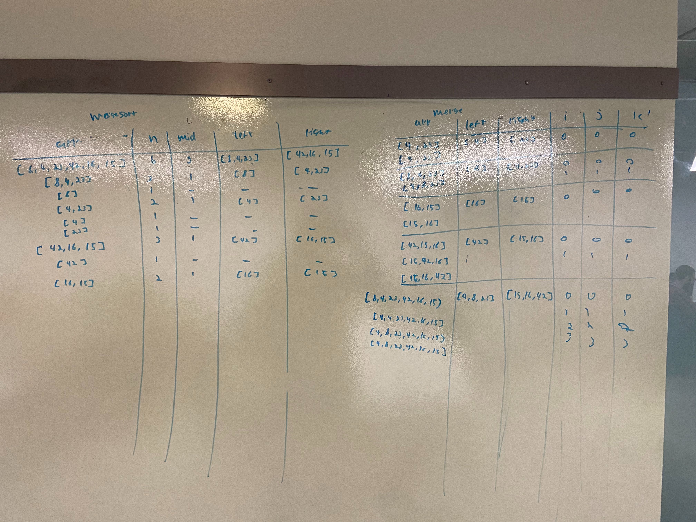
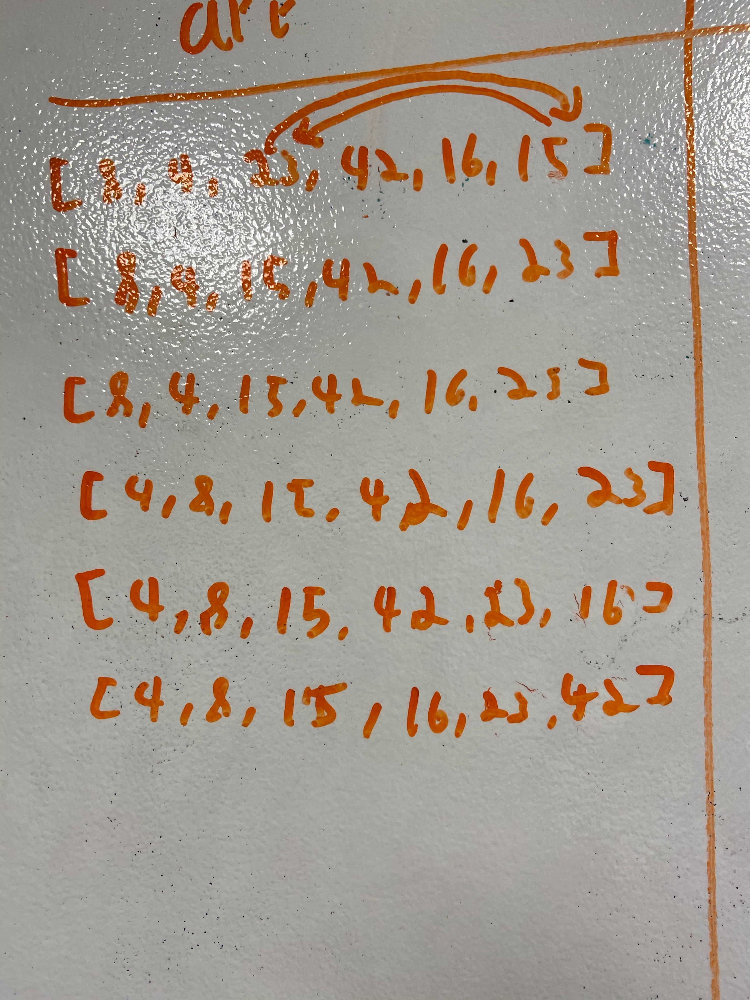

<h2>Insertion Sort</h2>

Insertion sort is an algorithm which iterates through an array and brings each value to the left until it is not less than the value to its left. The pseudocode for an insertion sort can be seen below.

Pseudocode
  InsertionSort(int[] arr)
  
    FOR i = 1 to arr.length
    
      int j <-- i - 1
      int temp <-- arr[i]
      
      WHILE j >= 0 AND temp < arr[j]
        arr[j + 1] <-- arr[j]
        j <-- j - 1
        
      arr[j + 1] <-- temp

The above image shows the array and the variables at each iteration through the for loop.

On the first pass through, 4 is brought all the way to the left.

On the second pass, 23 is not moved because it is greater than 8.

On the third pass, 42 is not moved because it is greater than 23.

on the fourth pass, 16 is moved to the left until it gets to 8.

On the fifth pass, 15 is moved to the left until it gets to 8.

Now the array is sorted.

<a href="../src/main/java/codechallenges/sort">Code here</a>

<h2>Insertion Sort</h2>

Mergesort is an algorithm with splits an array in half until it is individual elements in the array and then puts them all back together using another algorithm called Merge. The pseudocode can be seen below

ALGORITHM Mergesort(arr)
    DECLARE n <-- arr.length
           
    if n > 1
      DECLARE mid <-- n/2
      DECLARE left <-- arr[0...mid]
      DECLARE right <-- arr[mid...n]
      // sort the left side
      Mergesort(left)
      // sort the right side
      Mergesort(right)
      // merge the sorted left and right sides together
      Merge(left, right, arr)

ALGORITHM Merge(left, right, arr)
    DECLARE i <-- 0
    DECLARE j <-- 0
    DECLARE k <-- 0

    while i < left.length && j < right.length
        if left[i] <= right[j]
            arr[k] <-- left[i]
            i <-- i + 1
        else
            arr[k] <-- right[j]
            j <-- j + 1
            
        k <-- k + 1

    if i = left.length
       set remaining entries in arr to remaining values in right
    else
       set remaining entries in arr to remaining values in left

The following image is an incomplete picture of iterating through the array [8,4,23,42,16,15], I figured out what was happening in the end later while writing this blog post.

I think the best way to think about merge sort for a beginner is to think about basically making a pyramid out of the array by splitting in in half over and over... And then you pick the pieces up in order so you have them all sorted in the end.

If you have spent some time learning DSA, you might think about it like making a binary tree out of an array and then traversing that tree backwards using the call stack and placing each element according to its value as if it were a binary search tree... Maybe that is a good way to think about it.

The first thing that Mergesort does when you pass in [8,4,23,42,16,15] is split it in half... So, you have [8,4,23] and [42,16,15] and sort of like a post order traversal it breaks the left side down until it hits a leaf and then goes back up through the call stack sorting everything using Merge.

So, the first time merge is actually called it is Merge([4],[23],[4,23]) and then Merge([8],[4,23],[8,4,23])... And so on until the last time it is called Merge([4,8,23],[15,16,42],[8,4,23,42,16,15]) as you can see the left and right have been sorted and now the original array will have its values modified in place resulting in [4,8,15,16,23,42].

<a href="../src/main/java/codechallenges/sort">Code here</a>

<h2>Quick Sort</h2>

Quick sort is an algorithm that sorts an array by finding a pivot point and then iterating through the array swapping values such that the pivot point is then placed in the middle of the array with lower values on the left and higher values on the right. It then recursively calls itself and performs this same action on the left and right until the entire array is sorted. The iterative process can be seen in the following illustration:

The first pivot point is 15, and it is placed in the middle with the lower values on the left and the higher values on the right. It is then called again on the left side, and again on the right until it is fully sorted.

ALGORITHM QuickSort(arr, left, right)
    if left < right
        // Partition the array by setting the position of the pivot value 
        DEFINE position <-- Partition(arr, left, right)
        // Sort the left
        QuickSort(arr, left, position - 1)
        // Sort the right
        QuickSort(arr, position + 1, right)

ALGORITHM Partition(arr, left, right)
    // set a pivot value as a point of reference
    DEFINE pivot <-- arr[right]
    // create a variable to track the largest index of numbers lower than the defined pivot
    DEFINE low <-- left - 1
    for i <- left to right do
        if arr[i] <= pivot
            low++
            Swap(arr, i, low)

     // place the value of the pivot location in the middle.
     // all numbers smaller than the pivot are on the left, larger on the right. 
     Swap(arr, right, low + 1)
    // return the pivot index point
     return low + 1

ALGORITHM Swap(arr, i, low)
    DEFINE temp;
    temp <-- arr[i]
    arr[i] <-- arr[low]
    arr[low] <-- temp
    
    
<a href="../src/main/java/codechallenges/sort">Code here</a>