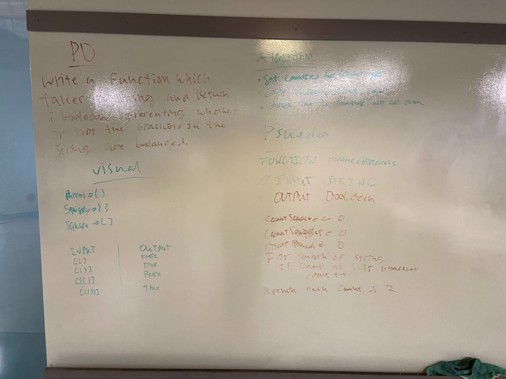

## Challenge
Your function should take a string as its only argument, and should return a boolean representing whether or not the brackets in the string are balanced. There are 3 types of brackets:
<ul>
<li>Round Brackets : ()</li>
<li>Square Brackets : []</li>
<li>Curly Brackets : {}</li>
</ul>

## Approach & Efficiency
I made a counters for each type of bracket. A left bracket increases the counter
and a right bracket decreases it. Method then returns boolean of all 3 equal to 0.

## Solution

<a href="../src/main/java/codechallenges/utilities">Code here</a>