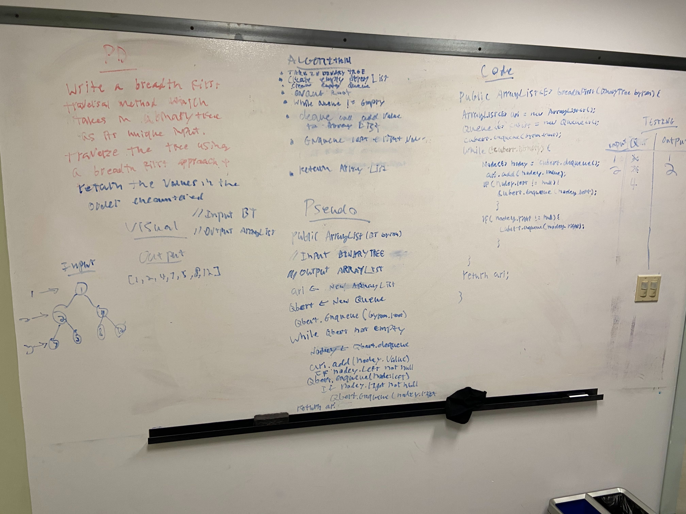

## Challenge

Write a breadth first traversal method which takes a Binary Tree as its unique input. Without utilizing any of the built-in methods available to your language, traverse the input tree using a Breadth-first approach, and return a list of the values in the tree in the order they were encountered.

## Approach & Efficiency
O(n)
A queue and a while loop are used to traverse the tree. An array list is then used to store the values in the order they are encountered. The array list is then returned.

## Solution

<a href="../src/main/java/codechallenges/tree">Code here</a>