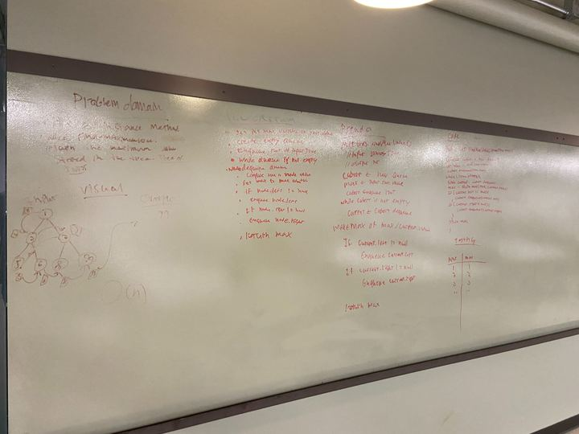

## Challenge

Write an instance method called find-maximum-value. Without utilizing any of the built-in methods available to your language, return the maximum value stored in the tree. You can assume that the values stored in the Binary Tree will be numeric.

## Approach & Efficiency
O(n)
A queue and a while loop are used to traverse the tree. An int variable is then used to store the max. The int is then returned.

## Solution

<a href="../src/main/java/codechallenges/tree">Code here</a>