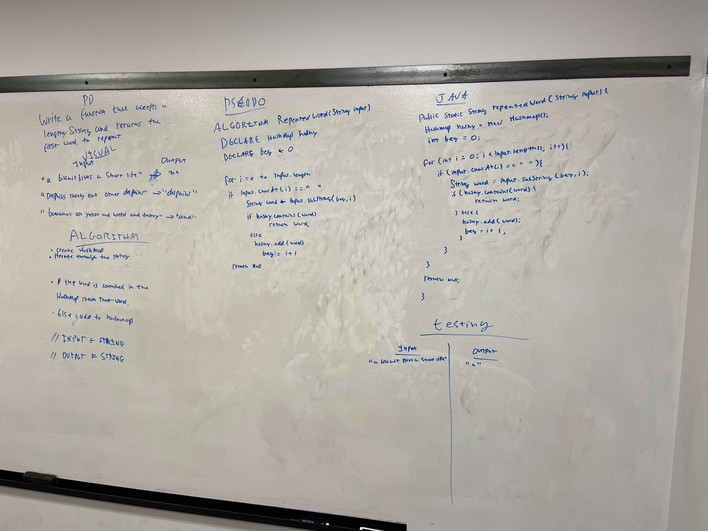

## Challenge

Write a function that accepts a lengthy string parameter.
Without utilizing any of the built-in library methods available to your language, return the first word to occur more than once in that provided string.

## Approach & Efficiency
I created a hashset and iterated through the string checking to see if it was contained in the hashset. If it was, I return that string, if not I added it to the hashset.

Time Complexity = O(n)
Space Complexity = O(n)

## Solution

<a href="../src/main/java/codechallenges/repeatedword">Code here</a>