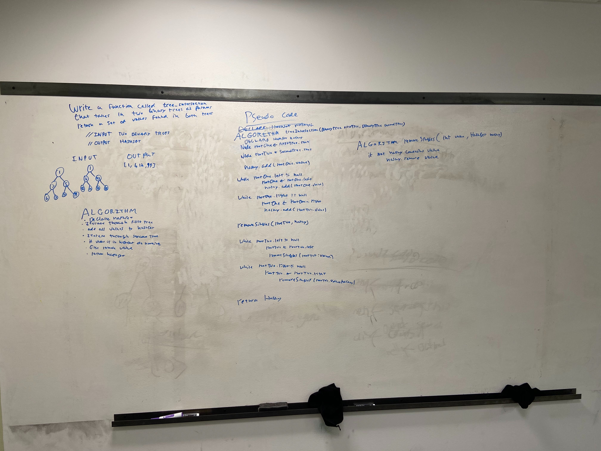

## Challenge

Write a function called tree_intersection that takes two binary tree parameters.
Without utilizing any of the built-in library methods available to your language, return a set of values found in both trees.

## Approach & Efficiency
I iterated through the first binary tree adding everything in it to a hash set. I then iterate through the second array and add each value in that array to an array list if it is contained in the hashset. I then returned the array.

## Solution

<a href="../src/main/java/codechallenges/treeintersection">Code here</a>