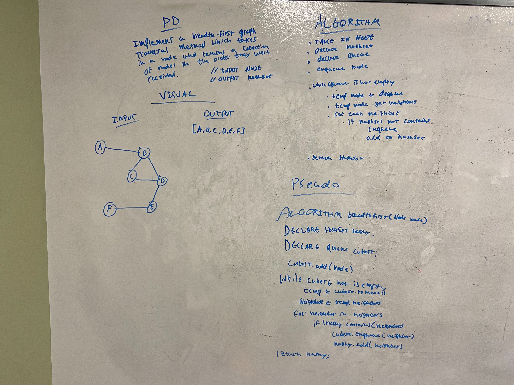

## Challenge

Extend your graph object with a breadth-first traversal method that accepts a starting node. Without utilizing any of the built-in methods available to your language, return a collection of nodes in the order they were visited. Display the collection.

## Approach & Efficiency
I basically wrote a breadth first tree traversal but instead added everything to a hashset as it went through so values would not repeat.

## Solution

<a href="../src/main/java/codechallenges/graph">Code here</a>