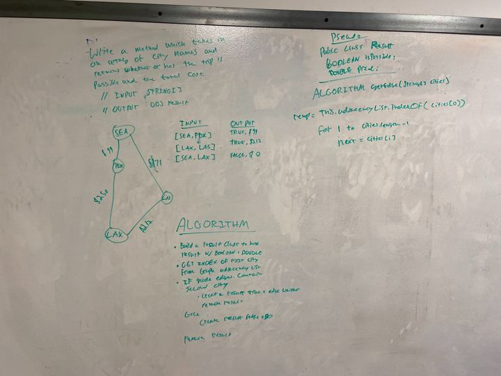

## Challenge

Write a function based on the specifications above, which takes in a graph, and an array of city names. Without utilizing any of the built-in methods available to your language, return whether the full trip is possible with direct flights, and how much it would cost.

## Approach & Efficiency
First I found the node representing the first city. Then for each subsequent city ensured that the previous city had an edge between that city and saved the cost and returned a Result object.

## Solution

<a href="../src/main/java/codechallenges/graph">Code here</a>